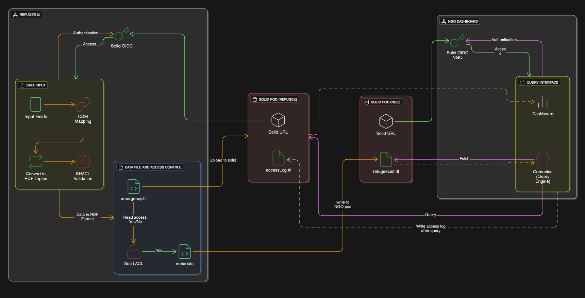

# Emergency Diary: My Secure Data Place

Emergency Diary is a decentralized web application designed to help people in emergency situations securely store, manage, and selectively share sensitive personal data with trusted humanitarian organisations. The application is built on the **Solid ecosystem** and **Linked Data technologies**, ensuring that individuals remain in control of their data at all times.

Instead of storing data in centralized databases owned by institutions, Emergency Diary stores all information directly in the user’s **Solid Pod** and uses explicit, consent-based access control to enable ethical data sharing.

---

## What Is This Application About?

In humanitarian and emergency contexts, individuals such as refugees or trafficking victims are often required to repeatedly share the same sensitive information with multiple organisations. This data is usually collected through fragmented systems such as paper forms, spreadsheets, or siloed databases, leading to:

* Loss of data ownership
* Privacy and security risks
* Inconsistent or duplicated information
* Limited interoperability between organisations

Emergency Diary explores an alternative approach where:

* Individuals **own and store** their emergency data
* Access is **explicitly granted and revoked** by the data owner
* Data is structured using **RDF and Linked Data** for interoperability
* NGOs can **query distributed data** without centralizing it

The project is implemented as a **pure client-side Single Page Application (SPA)** with no backend server.

---

## 📌 GitHub Repository

👉 https://github.com/GueshZebrehe/Emergency_Diary_main.git

---

## Prerequisites

* **Solid Pod**: A personal online data store owned by the user
* **WebID**: A decentralized identifier used for authentication and access control
* **RDF / Linked Data**: Semantic data model used for interoperability
* **Consent-based access**: NGOs can only access data after explicit approval

---

## Technology Stack

### Frontend

* React
* TypeScript
* Vite

### Solid & Linked Data

* `@inrupt/solid-client`
* `solid-client-authn-browser`
* `rdflib`
* RDF / Turtle serialization

### Validation & Querying

* SHACL validation (`rdf-validate-shacl`)
* SPARQL querying using Comunica

### Visualization

* Chart.js

---

## Architecture Overview

* The application runs entirely in the browser
* There is **no backend server**
* All data is stored in user-owned Solid Pods
* Authentication is handled via Solid OpenID Connect
* Access control is enforced by Solid Pod ACLs



---

## Requirements

Before running the application, make sure you have:

* **Node.js** (version 22 recommended)
* **npm** (comes with Node.js)
* A **Solid Pod account**
* A **Solid WebID**

You can create a Solid Pod using providers such as:

* https://solidcommunity.net

---

## How to Set Up the Application Locally

### 1. Clone the Repository

```bash
git clone https://github.com/GueshZebrehe/Emergency_Diary_main.git
cd Emergency_Diary_main
```

### 2. Install Dependencies

```bash
npm install
```

### 3. Start the Development Server

```bash
npm run dev
```

### The application will be available at:

```bash
http://localhost:5173/
```

---

## Authentication and Login

* Open the application in your browser.
* Click "My Secure Data Place" to login as refugee/emergency data owner or "Support Organisation" if you are an NGO

### Authenticate using Solid account:

* Login (if you already have an account)
* Create a new account (if needed)

---

## User Roles and Usage

### Refugee / Emergency Data Owner

* Create emergency records
* Store data securely in Solid Pod
* Manage access permissions

### NGO / Humanitarian Organisation

* Authenticate using WebID
* Discover shared records
* Query distributed data
* Visualize results

---

## End-to-End Data Flow

* User logs in using WebID
* Data is entered and converted to RDF
* Stored in Solid Pod
* Access granted to NGOs
* NGOs query data using SPARQL

---

## Final Presentation

Link to access slides of final presentation - [Link](https://docs.google.com/presentation/d/1QmYCiO__e2NlM8RE14cY8TLNW0KJvxN_/edit?usp=sharing&ouid=109819128229635806081&rtpof=true&sd=true)

---

## 👤 Author

**Guesh Zebrehe**
